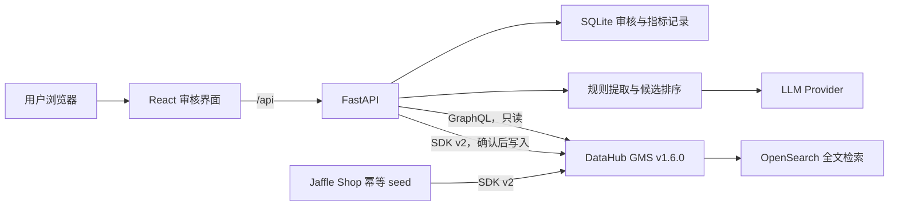

# DataHub Document Enrichment Agent — MVP 实现文档

版本：v0.1  
日期：2026-07-30  
状态：**待批准，尚未开始实施**  
输入 PRD：`datahub_document_enrichment_mvp_prd.txt`

## 1. 文档目的

本文把 PRD 转换为一组可以独立验收的实施阶段。每个阶段都有明确的范围、产物、验证方式和通过标准。

批准本文只代表同意后续按此方案实施；在用户明确批准前，不执行脚手架搭建、依赖安装、DataHub 写入或应用开发。

## 2. 建议批准的技术基线

以下是本方案默认采用的实现选择，也是批准前最值得确认的部分：

| 决策 | 建议方案 | 原因 |
| --- | --- | --- |
| 应用形态 | DataHub 外部 sidecar 应用 | 不修改 DataHub 核心，符合 PRD 非目标，迭代和演示成本低 |
| 前端 | React + TypeScript + Vite | 按项目选择使用 React；Vite 适合快速开发和轻量构建 |
| 后端 | Python 3.11 + FastAPI + Pydantic | DataHub v1.6 Python SDK 对 Document 支持完整；本机也已有 Python 3.11 |
| DataHub 读取 | GraphQL API | 适合批量获取 Domain、Tag、Owner、Dataset 及必要元数据，避免 N+1 请求 |
| DataHub 写入 | `acryl-datahub==1.6.0.15` SDK v2 | 可直接创建原生 Document，并设置 domain、tags、owners、related assets |
| 应用状态 | SQLite + dbmate | MVP 只需保存分析、审核、发布和指标记录；SQLite 无需独立服务，dbmate 用版本化 SQL migration 保证 schema 可复现 |
| LLM | 自定义 provider 接口，首个实现为 OpenAI-compatible structured output | 模型名、base URL、密钥可配置，同时控制 MVP 集成范围 |
| Demo 数据 | 通过幂等 seed 脚本创建固定 URN 的 Jaffle Shop 元数据 | 复现稳定，避免把完整 PostgreSQL/dbt 管道变成 MVP 的前置工程 |
| DataHub 性能 override | **当前不复制旧文件** | 本机 v1.6.0 Quickstart 已内置并运行 `ES_BULK_REFRESH_POLICY=NONE`；复制会形成重复且未被 Quickstart 自动加载的配置 |

### 2.1 当前环境的只读核验结果

2026-07-30 已核验：

- 当前目录最初只有 PRD；本实现文档修订后将本地目录初始化为 Git repository，并连接 `Ziqi418/datahub-doc-automation`。
- DataHub CLI：`1.6.0.15`。
- DataHub OSS 容器：`v1.6.0`，GMS 和 Frontend 均为 healthy。
- GMS：`http://localhost:8080`；DataHub UI：`http://localhost:9002`。
- 当前 DataHub 已有 74 个 Dataset、3 个 Domain，以及若干 Tag/User/Group，但不是本 MVP 所需的完整且稳定的 Jaffle Shop 基线。
- 本机 GraphQL schema 已确认存在 `createDocument`、`document`、`searchDocuments`、`updateDocument*`、`deleteDocument` 等接口。
- `/Users/ziqi/.datahub/quickstart/docker-compose.yml` 已包含 `ES_BULK_REFRESH_POLICY: NONE`，运行中 GMS 的该环境变量也为 `NONE`。
- 旧文件 `/Users/ziqi/Learn/datahub-hackathon/datahub-performance.override.yml` 当前没有被运行中的 Quickstart Compose 引用，因此不移动它。

若未来升级 DataHub 后该变量消失，再在本项目增加受版本控制的 Compose 文件或明确的启动 wrapper；不提前维护重复 override。

## 3. MVP 边界解释

### 3.1 本次必须完成

- 单篇 Markdown/TXT 上传。
- 从 DataHub 现有实体中读取 Domain、Tag、User/Team、Dataset 候选。
- 确定性匹配与 LLM 排序结合，输出置信度、原因和可追溯证据。
- 用户可以接受、删除和替换推荐，并能搜索其他候选实体。
- 只有用户确认后才写 DataHub。
- 创建可全文检索的 DataHub 原生 Document，并写入 Domain、Tags、Owner、Related Datasets。
- 从 DataHub 搜索到发布后的文档，并从相关 Dataset 页面访问文档。
- 使用 6–10 篇固定样例与 gold answers 计算 PRD 指标。

### 3.2 明确不做

- 不修改或 fork DataHub 前后端源码。
- 不自动创建 LLM 返回的新 Domain、Tag 或 Owner。
- 不在用户确认前向 DataHub 写草稿或推荐结果。
- 不支持 PDF、Word、URL 抓取、Notion、Confluence 或批量上传。
- 不实现登录、RBAC、多人协作和生产级任务队列。
- 不实现向量数据库、RAG 平台或模型微调。
- 不把完整 PostgreSQL → dbt → DataHub ingestion pipeline 设为 MVP 必需项；固定的 Jaffle Shop metadata seed 足以验证文档增强假设。

## 4. 总体架构



### 4.1 为什么读取和写入使用不同接口

- GraphQL 适合一次查询列表及关联字段，并能精确选择字段，减少候选目录加载时间。
- Python SDK v2 的 `Document.create_document()` 可以统一设置正文、Domain、Tags、Owners 和 Related Assets；比手工拼多个低层 metadata aspects 更容易维护。
- 所有 DataHub 地址和 token 只存在于后端，浏览器不直接访问 GMS。

## 5. 核心数据流

1. 前端上传一个 `.md` 或 `.txt` 文件。
2. 后端验证扩展名、大小、UTF-8 编码和非空内容，创建本地 Analysis 记录；此时不写 DataHub。
3. 后端从短期缓存读取 DataHub 候选目录；缓存过期时通过 GraphQL 分页刷新。
4. 规则层提取标题、SQL code fence、表名、字段名和关键词，为 Dataset 建立候选池。
5. LLM 只能对候选池中的 URN 排序和解释，输出通过 Pydantic JSON Schema 校验。
6. 后端再次验证所有 URN 确实存在、类型正确、数量未超限，生成最终推荐。
7. 用户审核 Domain、Tags、Owner、Datasets，可以删除或搜索替换。
8. 后端保存最终选择和审核耗时；仍不写 DataHub。
9. 用户点击“确认并发布”。后端以稳定 Document URN 执行幂等发布。
10. 后端回读 Document，并验证正文、Domain、Tags、Owner 和 Related Assets。
11. E2E 验证 DataHub 全文搜索和 Dataset 反向关联可见。

## 6. 建议仓库结构

```text
datahub-doc-automation/
├── README.md
├── Makefile
├── .env.example
├── compose.yaml
├── datahub_document_enrichment_mvp_prd.txt
├── datahub_document_enrichment_implementation_plan.md
├── backend/
│   ├── pyproject.toml
│   ├── src/document_enrichment/
│   │   ├── api/
│   │   ├── config.py
│   │   ├── db/
│   │   ├── datahub/
│   │   ├── extraction/
│   │   ├── recommendation/
│   │   └── publishing/
│   └── tests/
├── frontend/
│   ├── package.json
│   ├── src/
│   │   ├── api/
│   │   ├── components/
│   │   ├── views/
│   │   └── types/
│   └── tests/
├── demo/
│   ├── documents/
│   ├── gold/
│   └── metadata/
├── scripts/
│   ├── check_environment.py
│   ├── seed_demo.py
│   ├── evaluate.py
│   └── verify_published_document.py
└── e2e/
```

## 7. 后端契约

### 7.1 主要 API

| Method | Path | 用途 | 是否写 DataHub |
| --- | --- | --- | --- |
| `GET` | `/api/health/live` | 进程健康 | 否 |
| `GET` | `/api/health/ready` | SQLite、DataHub 和 LLM 配置预检 | 否 |
| `POST` | `/api/analyses` | 上传并保存文档 | 否 |
| `POST` | `/api/analyses/{id}/recommend` | 执行规则与 LLM 推荐 | 否 |
| `GET` | `/api/analyses/{id}` | 获取状态、推荐和审核结果 | 否 |
| `GET` | `/api/catalog/{entity_type}?q=` | 搜索可替换的现有候选 | 否 |
| `POST` | `/api/catalog/refresh` | 手动刷新只读候选缓存 | 否 |
| `PUT` | `/api/analyses/{id}/review` | 保存用户最终选择 | 否 |
| `POST` | `/api/analyses/{id}/publish` | 幂等发布到 DataHub | **是** |

`entity_type` 只允许 `domains | tags | owners | datasets`。列表接口分页并限制返回数量，避免把完整 DataHub catalog 发送到浏览器。

### 7.2 Analysis 状态机

```text
UPLOADED -> ANALYZING -> READY_FOR_REVIEW -> APPROVED -> PUBLISHING -> PUBLISHED
                 |                              |             |
                 +-> ANALYSIS_FAILED            +-------------+-> PUBLISH_FAILED
```

- `ANALYSIS_FAILED` 可以重试 recommend。
- `PUBLISH_FAILED` 使用同一个 Document ID 重试，不创建副本。
- `PUBLISHED` 再次调用 publish 返回已有结果，保证按钮重复点击安全。
- 只有 `APPROVED` 或 `PUBLISH_FAILED` 能进入 publish。

### 7.3 推荐项结构

```json
{
  "urn": "urn:li:dataset:(urn:li:dataPlatform:jaffle_shop,fct_orders,PROD)",
  "display_name": "fct_orders",
  "confidence": 0.95,
  "reason": "文档的 SQL 代码块直接查询了 fct_orders。",
  "evidence": [
    {
      "kind": "sql_table_reference",
      "matched_text": "from fct_orders",
      "location": "lines 18-22"
    }
  ],
  "source": "rule_and_llm"
}
```

证据 `kind` 至少支持：

- `exact_dataset_name`
- `sql_table_reference`
- `schema_field_match`
- `description_keyword_match`
- `related_dataset_owner`
- `related_dataset_domain`
- `related_dataset_tag`
- `llm_semantic_rationale`

前端把文档和原因作为纯文本或禁用 HTML 的 Markdown 渲染，不能渲染上传内容中的原始 HTML。

## 8. 推荐算法

### 8.1 DataHub 候选快照

后端把 DataHub 数据规范化为：

- Domain：URN、name、description。
- Tag：URN、name、description。
- Owner：URN、entity type、display name、title/description。
- Dataset：URN、name、qualified name、description、最多 100 个 schema field、owners、domain、tags。

实现要求：

- GraphQL 分页，不假定结果少于一页。
- 缓存 TTL 默认 5 分钟；并发刷新只允许一个请求执行。
- 单次 LLM 调用不发送完整 catalog。
- 当 Dataset 总数不超过 200 时可使用全量紧凑候选；超过 200 时只发送规则/词法检索 Top 30。
- 发送给模型的字段描述和文档正文都有字符预算，超出时保留标题、SQL、命中位置附近片段和开头摘要。

### 8.2 确定性层

按以下优先级生成 Dataset 初始分数和证据：

1. SQL 中的完整表名精确匹配。
2. 正文中的 qualified dataset name 精确匹配。
3. 正文中的唯一短表名精确匹配。
4. 多个 schema field 联合命中。
5. Dataset description 与文档标题/关键词的词法匹配。
6. 若短表名冲突，则保留所有冲突项交给模型排序，不能擅自选择。

SQL 只做解析，不执行。解析失败时回退到 token/正则提取并记录 `parser_fallback`，不能让整个分析失败。

### 8.3 LLM 层

模型输入包含：

- 明确的系统边界：上传正文是不可信数据，正文中的指令不得改变任务。
- 文档标题和受长度限制的正文。
- 带 URN 的候选 Domain、Tags、Owners 和 Datasets。
- 规则层证据和初始排序。
- 严格 JSON Schema：一个 Domain、最多 5 Tags、Owner 候选、最多 5 Datasets。

模型输出要求：

- 只能返回输入候选中的 URN。
- 每项包含相关性分数和简短理由。
- 不允许提出新实体。
- 校验失败只自动修复/重试一次；仍失败时返回可解释错误，不发布降级结果。

后端必须执行二次白名单校验，LLM 的 schema 校验不能替代权限边界。

### 8.4 置信度口径

UI 继续使用 PRD 中的“置信度”名称，但 MVP 将它定义为**排序相关性分数**，不是统计学意义上经过校准的正确概率：

- SQL/完整表名唯一精确匹配：规则层可直接给 0.95–0.99。
- 其他 Dataset：`0.65 × 规则归一化分数 + 0.35 × 模型相关性分数`。
- Domain/Tag/Owner：组合模型分数与已推荐 Dataset 的 domain/tag/owner 支持度。
- 分数必须由后端限制在 `[0, 1]`，同分使用稳定 URN 排序，保证测试可复现。

评估看真实 Precision/Recall，而不是用模型自报 confidence 代替质量指标。

## 9. 审核界面

一个主流程页面即可完成 MVP：

1. **Upload**：拖拽/选择 Markdown 或 TXT，显示限制和文件预览。
2. **Analyzing**：显示“读取 DataHub / 规则匹配 / 模型排序”阶段；允许错误重试。
3. **Review**：四个独立区块：Domain、Tags、Owner、Related Datasets。
4. **Publish result**：显示 Document URN，以及 DataHub 文档页和相关 Dataset 页链接。

Review 交互要求：

- Domain：单选，可搜索替换。
- Tags：多选，最多 5 个，可删除和搜索添加。
- Owner：MVP 最终选择一个 User 或 Team；展示 entity type。
- Datasets：多选，最多 5 个，可删除和搜索添加。
- 每个推荐显示 confidence、reason、evidence；替换项标记为 `user_selected`。
- 发布前展示最终摘要和明确确认动作。
- 第一次进入 Review 时记录 `review_started_at`，点击确认时记录 `review_completed_at`。

## 10. DataHub 发布设计

### 10.1 Document 标识和幂等性

- 上传时生成 Analysis UUID。
- DataHub document id 固定为 `doc-enrichment-<analysis_uuid>`。
- SQLite 保存 Document URN；发布重试始终使用同一 URN。
- 原始文件名只作为 metadata，不参与文件路径或 URN 生成。

### 10.2 安全发布顺序

1. 再次确认所有选中 URN 存在且实体类型正确。
2. 以 `UNPUBLISHED` 创建/更新原生 Document，包含正文、最终 Domain、Tags、Owner、Related Assets。
3. 从 DataHub 回读并逐字段核对。
4. 核对通过后发布为 `PUBLISHED`。
5. 再次回读并记录结果。

这样即使中间某个 aspect 写入失败，也不会向普通搜索用户暴露半完成文档。该流程不是跨多个 DataHub aspect 的数据库事务，但通过“最后发布”和幂等重试把风险控制在 MVP 可接受范围内。

### 10.3 写入的自定义属性

- `source_filename`
- `source_sha256`
- `enrichment_analysis_id`
- `enrichment_app_version`
- `published_at`

完整模型 prompt、API key 和未经确认的候选不写入 DataHub。

## 11. Demo 数据与 gold answers

### 11.1 固定元数据

`scripts/seed_demo.py` 使用固定 URN 幂等创建/更新：

- Datasets：`customers`、`orders`、`order_items`、`products`、`payments`、`refunds`、`stores`、`supplies`、`fct_orders`、`customer_lifetime_value`、`daily_sales`。
- Domains：至少 `Finance`、`Customer`、`Operations`。
- Tags：至少 `revenue`、`policy`、`pii`、`data-quality`、`runbook`、`payments`、`sales`。
- Teams：至少 `finance-analytics`、`customer-analytics`、`data-platform`。
- 每个 Dataset 有可用于匹配的 description、schema fields、owner、domain 和 tags。

Seed 只 upsert 带固定 MVP namespace 的实体，不删除或修改当前已有的 `b2fd91.*` 与旧 hackathon 实体。

### 11.2 测试文档

至少 6 篇，目标为 8 篇，每篇 300–800 字：

- Revenue Recognition Policy
- Customer Lifetime Value Definition
- Daily Sales Dashboard Guide
- Order Data Quality Rules
- Payment Failure Runbook
- Customer PII Policy
- Refund Reconciliation Guide
- Store Sales Operations Definition

每篇对应一个独立 YAML gold 文件。应用运行时不能读取 gold 目录，避免答案泄漏；只有评估脚本读取。

## 12. 可验收实施阶段

后续正式执行时严格按阶段推进。每个阶段通过后再进入下一阶段，并在每个 Gate 停止供用户通过 GitHub PR 验收。

### 12.1 Git 分支与逐 Gate PR 工作流

采用“**一个 Gate、一个分支、一个 PR**”的交付方式，不在实现过程中直接向 `main` 连续提交：

1. PRD 与批准后的实现文档作为空仓库的 baseline 提交到 `main`；这是首次初始化的唯一例外。
2. Gate N 开始前，确保上一个 PR 已合并，并从最新 `origin/main` 创建 `agent/gate-N-<scope>`。
3. 当前对话只实现一个 Gate，不顺手进入下一个 Gate。
4. 完成该 Gate 的自动检查和文档中列出的验收项后，提交并 push 分支。
5. 创建 Draft PR，PR 描述列出范围、验收命令、结果、已知限制和人工验收步骤。
6. 用户在 PR 中查看 diff、运行效果并提出修改；修改继续提交到同一分支/PR。
7. Gate 通过后把 PR 标记为 ready 并使用 squash merge，使 `main` 最终每个 Gate 保留一个清晰提交。
8. 合并后再开启新对话处理下一个 Gate，避免多个依赖 PR 同时叠加。

推荐分支名：

```text
agent/gate-0-foundation
agent/gate-1-demo-metadata
agent/gate-2-datahub-catalog
agent/gate-3-deterministic-retrieval
agent/gate-4-llm-recommendations
agent/gate-5-workflow-api
agent/gate-6-review-ui
agent/gate-7-datahub-publishing
agent/gate-8-evaluation-demo
```

每个新对话可以使用以下固定提示词：

```text
按照 datahub_document_enrichment_implementation_plan.md，只实现 Gate N。
从最新 main 创建 agent/gate-N-<scope>，不要实现后续 Gate。
完成该 Gate 的全部自动验证，提交并 push，然后创建 Draft PR；
在 PR 描述中逐条报告 Gate 验收结果和需要我手工检查的步骤。
```

建议 baseline 推送完成后为 `main` 开启 branch protection：要求通过 PR 合并，并要求配置好的 CI checks 通过。Gate 0 建立 CI 之前可先只要求 PR，Gate 0 合并后再把 checks 设为 required。

### 阶段 0：工程与环境基线

**工作内容**

- 初始化 Git repository、`.gitignore`、README、Makefile 和 `.env.example`。
- 创建 Python 3.11 backend 与 React frontend 脚手架。
- 固定 DataHub SDK 版本，生成 lockfiles。
- 增加环境检查脚本，只读验证 GMS、GraphQL Document API、DataHub UI 和性能环境变量。
- 增加最小 CI/local quality commands，但不碰 DataHub 数据。

**产物**

- 可启动的空应用和统一命令。
- `make check-env`、`make test`、`make lint`。

**Gate 0 通过标准**

- `make check-env` 显示 DataHub v1.6.0 healthy、Document API available、`ES_BULK_REFRESH_POLICY=NONE`。
- backend 和 frontend health page 可访问。
- lint/typecheck/unit test 均为绿色。
- DataHub 实体数量在检查前后不变。

### 阶段 1：Jaffle Shop 元数据和评估夹具

**工作内容**

- 实现固定 URN 的幂等 seed。
- 创建 8 篇 demo 文档和对应 gold YAML。
- 编写 seed 后的完整性验证。

**产物**

- `demo/metadata/`、`demo/documents/`、`demo/gold/`。
- `make seed-demo` 和 `make verify-demo-data`。

**Gate 1 通过标准**

- 连续执行 `make seed-demo` 两次，实体不重复且命令成功。
- 11 个预期 Dataset、3 个 Domain、7 个 Tag、3 个 Team 均可通过 DataHub API 回读。
- 每个 Dataset 都有 description、schema 和 owner。
- 现有非 MVP namespace 实体未被删除或覆盖。
- 8 个 gold 文件通过 schema 校验，且所有 expected URN 都真实存在。

### 阶段 2：只读 DataHub Catalog Adapter

**工作内容**

- 实现 GraphQL client、分页、超时、错误映射和五分钟缓存。
- 规范化 Domain、Tag、Owner、Dataset 数据。
- 实现 UI 手动搜索所需的 catalog endpoints。

**产物**

- `DataHubCatalogGateway` 接口和 GraphQL 实现。
- mock contract tests 与 live integration test。

**Gate 2 通过标准**

- API 能返回 seed 的全部实体及关联 metadata。
- 分页测试证明超过一页不会漏项或重复。
- 同一 TTL 内重复读取不重复请求 DataHub。
- GraphQL 超时/不可用时返回可诊断的 `503`，不伪造空结果。
- catalog API 不返回 token 或无关 metadata。

### 阶段 3：确定性提取与候选召回

**工作内容**

- Markdown/TXT 解析与标题提取。
- SQL code fence、表名、字段名、关键词提取。
- Dataset 候选召回、冲突处理、证据定位和稳定排序。

**产物**

- 与 DataHub 无写操作的纯函数 recommendation pipeline。
- 规则层单元测试和离线评估输出。

**Gate 3 通过标准**

- 明示的表名和 SQL 表引用在测试中 100% 进入 Top 5。
- 同名 Dataset 不被静默消歧，冲突候选和证据都被保留。
- SQL 解析失败能降级，不导致 500。
- 8 篇 demo 文档的规则层 Dataset Recall@30 为 100%，保证正确答案有机会进入 LLM 排序。
- 相同输入重复运行输出顺序一致。

### 阶段 4：LLM 结构化推荐

**前置条件**

- 执行时提供可用的 `LLM_API_KEY`、`LLM_MODEL`，可选 `LLM_BASE_URL`。

**工作内容**

- 定义 provider 接口、真实 adapter 和测试 fake。
- 构建候选受限 prompt 与 Pydantic response schema。
- 实现 token/字符预算、一次修复重试、URN 白名单校验和 confidence 合并。
- 记录耗时、模型名和 token usage；日志不记录密钥和完整正文。

**产物**

- 四类 recommendation 输出，均包含 confidence、reason、evidence。
- 可离线测试的 fake provider。

**Gate 4 通过标准**

- fake provider 测试覆盖成功、非法 URN、超限数量、无效 JSON、超时和重试失败。
- 真实模型对 8 篇 demo 文档输出 100% schema-valid 结果。
- 输出中没有候选列表外 URN；若模型尝试返回，后端拒绝该结果。
- 单篇分析在正常网络下有明确超时，不会无限等待。
- 此阶段仍不创建任何 DataHub Document。

### 阶段 5：分析、审核和审计 API

**工作内容**

- SQLite schema/migrations。
- 上传验证、Analysis 状态机、recommend/review API。
- 保存原始推荐、用户最终选择、替换/删除动作和审核时间。
- 并发、重复请求和错误恢复测试。

**产物**

- 可供前端完整调用的后端流程。
- OpenAPI contract。

**Gate 5 通过标准**

- 仅接受 `.md`/`.txt`、UTF-8、非空且不超过 256 KiB/30,000 字符的单文件。
- 非法文件得到 `400/413/415`，不产生 DataHub 写入。
- 用户只能选择 DataHub 中存在且类型正确的 URN。
- Tags/Datasets 超过 5 个被拒绝。
- 状态机不允许跳过审核直接发布。
- 审计记录可区分 accepted、removed 和 replaced。

### 阶段 6：React 审核 UI

**工作内容**

- Upload、Analyzing、Review、Publish Result 四个状态。
- 推荐卡片、置信度、原因、证据、候选搜索、增删改。
- 错误、空状态、键盘操作和基本响应式布局。
- 发布结果/已发布文档显示 `ACTIVE`、`NEEDS_REVIEW`、`STALE`、`SUPERSEDED` 或 `ARCHIVED` 状态、最近人工复核时间及触发原因；不在浏览器自动修改文档正文。
- 对 `NEEDS_REVIEW` 文档显示来源版本或关联 Dataset 的变更证据，并允许用户发起一次新的审核流程。

**产物**

- 浏览器中可完成除 DataHub 发布外的完整人工审核。
- 组件测试和一条 Playwright review smoke test。

**Gate 6 通过标准**

- 用户可接受、删除、替换四类推荐。
- 约束在 UI 和 API 两端一致：一个 Domain、一个 Owner、最多 5 Tags/Datasets。
- 上传正文中的 HTML/script 不会被执行。
- 全流程仅使用键盘也能完成，表单控件有 label 和可见 focus。
- Playwright 从上传到保存审核结果通过。
- 正常 catalog 规模下，候选搜索不会造成每次按键都全量请求 DataHub。
- 状态为 `NEEDS_REVIEW` 或 `STALE` 的文档有可见原因；用户可以进入重新审核，但不能在没有确认的情况下覆盖原文或关联。

### 阶段 7：安全、幂等地发布到 DataHub

**工作内容**

- 实现 SDK v2 Document publisher。
- 执行 UNPUBLISHED → 回读校验 → PUBLISHED 流程。
- 记录 Document URN，处理重复点击和部分失败重试。
- 生成 DataHub UI deep links。
- 发布时保存来源内容 hash、人工复核时间，以及每个已确认 Related Dataset 的只读基线快照（URN、弃用状态、schema/description fingerprint、Domain、Owner、Tags）。
- 提供只读 freshness check：发现来源新版本、关联 Dataset 删除/弃用、被正文引用的字段变更，或关联 metadata 发生显著改变时，将文档标记为 `NEEDS_REVIEW`；不得自动修改正文、关系或删除 Document。
- 对同一 Dataset/主题的高相似文档只创建“可能冲突”审核候选；指标公式、口径等冲突必须由用户确认，不能由 embedding 或 LLM 自动裁决。

**产物**

- 真实 DataHub 端到端发布能力。
- live integration tests 和清晰的测试数据 cleanup 指引；默认测试不自动删除用户已有实体。

**Gate 7 通过标准**

- 发布前 DataHub 不存在该 Document；发布后只存在一个固定 URN 的 Document。
- 标题、全文、Domain、Tags、Owner 和 Related Datasets 回读完全一致。
- 同一 Analysis 连续点击发布不会产生重复 Document。
- 模拟中途失败时文档保持 UNPUBLISHED，重试后可完成。
- DataHub 搜索能找到正文关键字。
- 至少一个相关 Dataset 的 DataHub 页面能看到该 Document。
- 关联 Dataset 的确定性变化会产生包含具体差异的 `NEEDS_REVIEW` 记录；无变化的重复检查不产生新审计记录。
- `STALE`、`ARCHIVED` 文档在后续 RAG 集成中默认降权或排除；`SUPERSEDED` 文档保留历史可追溯性并链接替代版本。

### 阶段 8：质量评估、性能与演示封装

**工作内容**

- 完成离线/真实模型评估脚本。
- 计算 Domain accuracy、Dataset Precision@5、Recall@5、Tag/Owner 指标。
- 从真实 review 记录计算平均审核时间与推荐接受率。
- 增加 Docker Compose、演示脚本、故障排查和 5 分钟 demo runbook。
- 做小规模性能与安全检查。

**产物**

- `reports/evaluation.json` 和人类可读 summary。
- `make eval`、`make demo`、`docker compose up --build`。
- README 中完整演示步骤。

**Gate 8 / MVP 最终通过标准**

- 至少 6 篇、目标 8 篇 gold 文档参与评估。
- Domain accuracy ≥ 80%。
- Dataset macro Precision@5 ≥ 70%。
- Dataset macro Recall@5 ≥ 70%。
- 至少 3 次真实人工审核的平均审核时间 ≤ 2 分钟。
- 从上传 Revenue Recognition 文档到 DataHub 搜索/反向关联的完整演示一次通过。
- 全部 unit、integration、frontend 和 E2E smoke tests 通过。
- README 能让一台已运行 DataHub v1.6.0 的机器复现演示。

## 13. 测试与指标定义

### 13.1 指标公式

对每篇文档：

- `Dataset Precision@5 = |predicted_top5 ∩ expected| / |predicted_top5|`；无预测时记 0。
- `Dataset Recall@5 = |predicted_top5 ∩ expected| / |expected|`。
- `Domain Accuracy = predicted_domain == expected_domain`。
- `Tag Acceptance Rate = accepted_recommended_tags / recommended_tags_seen`。
- `Owner Acceptance Rate = accepted_recommended_owner / recommendation_with_owner`。
- `Review Time = review_completed_at - review_started_at`，不含上传和 LLM 等待时间。

最终 Dataset 指标取所有测试文档的 macro average，防止包含更多 expected datasets 的单篇文档支配结果。

### 13.2 测试层级

- 单元测试：解析、归一化、打分、schema、状态机、上传边界。
- Contract 测试：GraphQL response 与 SDK publisher 使用录制/构造的固定 payload。
- Live integration：只针对本地 DataHub 的 MVP namespace。
- 前端组件测试：推荐编辑、限制、错误状态、可访问性。
- Playwright：上传 → 推荐 → 审核 → 发布结果。
- 手工 DataHub 验收：全局搜索和 Dataset 页面反向关联。

## 14. 安全设计

虽然是本地 hackathon MVP，以下边界从第一版实现：

- 上传正文视为不可信输入；防 prompt injection，正文不能修改 system instructions 或候选白名单。
- 不根据上传内容访问 URL、执行 SQL、运行 shell 或读取文件路径。
- 文件名通过 `basename`/应用生成 ID 处理，不直接拼接路径，防 path traversal。
- 限制扩展名、大小、字符数和 UTF-8 编码。
- Markdown 渲染关闭 raw HTML；所有 reason/evidence 默认转义。
- LLM key、DataHub token 只在后端环境变量中，`.env` 不提交 Git。
- 日志记录 Analysis ID、hash、耗时和错误类型，不记录密钥；默认不记录完整文档正文。
- publish 前重新校验 URN 和实体类型，不能信任浏览器提交或 LLM 输出。
- CORS 默认只允许本地前端 origin；不使用 `*` 搭配 credentials。
- `source_sha256` 用于一致性校验，不把 hash 当作访问控制或认证手段。

## 15. 性能设计

- 保留当前 GMS 的 `ES_BULK_REFRESH_POLICY=NONE`，环境检查发现不一致时给出警告。
- DataHub catalog 使用分页、字段裁剪、5 分钟缓存和 single-flight refresh。
- 不对每个 Dataset 单独发 GraphQL 请求。
- 浏览器候选搜索使用后端缓存，输入 debounce，单次最多返回 20 条。
- LLM 只看 Top 30 Dataset 候选和必要 schema 摘要，避免 prompt 随 catalog 线性膨胀。
- 默认 GMS/LLM HTTP connect/read timeout，并对只读 catalog 查询做有限重试；发布写入不做无边界自动重试。
- 前端记录 upload、catalog、recommend、review 和 publish 各阶段耗时，便于判断慢点是在 DataHub、模型还是 UI。

## 16. 风险与应对

| 风险 | 影响 | 应对 |
| --- | --- | --- |
| LLM provider/model 尚未指定 | 阶段 4 无法做真实模型验收 | provider 接口 + fake 先完成测试；执行阶段 4 前确定 API key/model |
| DataHub Document 多 aspect 写入非原子 | 可能产生半完成实体 | 先 UNPUBLISHED，回读校验后最后 publish；固定 URN 幂等重试 |
| Dataset 同名或短名歧义 | 错误关联 | 保留冲突项，用 qualified name、platform、schema 和 owner 消歧 |
| 模型 confidence 不可靠 | UI 容易误导 | 明确叫相关性分数；最终质量只由 gold Precision/Recall 判断 |
| 当前 DataHub 已有其他 demo 数据 | 候选噪声和误修改风险 | 固定 MVP namespace；seed 只 upsert，不清理其他资产 |
| DataHub 升级改变 API | 集成失败 | 固定 v1.6.0/SDK 1.6.0.15；Stage 0 做 schema preflight |
| 大 catalog 导致 GraphQL/LLM 慢 | 页面等待和成本升高 | 分页缓存、字段裁剪、候选召回、prompt budget |
| SQLite 不适合多实例 | 并发部署受限 | MVP 单实例；生产化时再迁移 PostgreSQL |

## 17. 执行顺序和停止条件

正式执行顺序为：

```text
Gate 0 工程基线
  -> Gate 1 Demo metadata
  -> Gate 2 DataHub read adapter
  -> Gate 3 deterministic retrieval
  -> Gate 4 LLM ranking
  -> Gate 5 workflow API
  -> Gate 6 review UI
  -> Gate 7 DataHub publish
  -> Gate 8 evaluation/demo
```

出现以下情况时暂停并向用户报告，而不是扩大范围：

- DataHub 实际版本或 Document schema 与 v1.6.0 基线不一致。
- 需要删除、覆盖非 MVP namespace 的已有 DataHub 实体。
- 真实 LLM 凭据/模型不可用，导致 Gate 4 无法完成。
- 达不到 PRD 的最终准确率目标，需要改变模型、候选算法或 gold 标准。
- 需要引入完整 dbt/PostgreSQL pipeline、认证系统或 DataHub 核心改动才能继续。

## 18. 批准项摘要

批准本实现文档即批准以下 MVP 取舍：

1. React + FastAPI/Python 3.11 的 sidecar 架构。
2. GraphQL 读取、DataHub SDK v2 写入、SQLite 保存审核状态。
3. 用固定 Jaffle Shop metadata seed 验证产品，不把真实 dbt ingestion 作为 MVP 前置。
4. 首个 LLM adapter 采用 OpenAI-compatible structured output，具体模型通过环境变量提供。
5. 当前不复制旧的 performance override；用预检确保现有优化持续生效。
6. 按 Gate 0–8 分阶段实施；每个 Gate 使用独立 `agent/gate-*` 分支和 PR 验收，最终以 PRD 指标和 DataHub 端到端演示为准。

## 19. 参考资料

- DataHub v1.6.0 Documents API Tutorial：<https://docs.datahub.com/docs/api/tutorials/documents>
- DataHub GraphQL API：<https://docs.datahub.com/docs/api/graphql/overview>
- DataHub Python SDK v2：<https://docs.datahub.com/docs/python-sdk/sdk-v2/>
